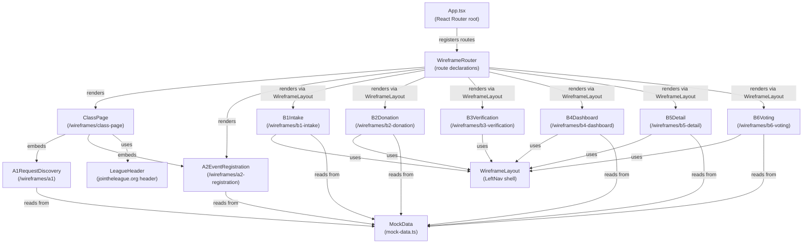
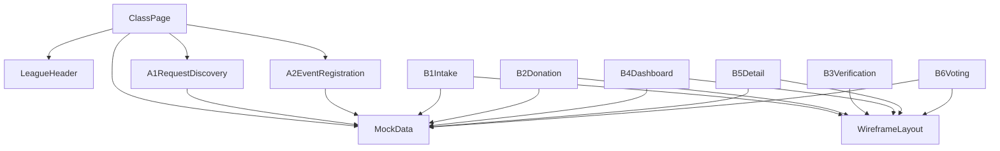

# Architecture Update — Sprint 001: Live Wireframes — Public Page Mockups

## Step 1: Problem Understanding

This sprint adds navigable HTML wireframes served by the existing Vite/React dev server. The goal is to give stakeholders clickable mockups of all public-facing screens before any backend logic is built.

The existing client is a React + Vite single-page application with React Router. It already has a production page hierarchy under `client/src/pages/`. The wireframes are isolated to a new subdirectory so they can be removed or deprecated later without touching production code.

There are no server changes, no database changes, and no new API endpoints. The entire sprint is client-side only.

## Step 2: Responsibilities

This sprint introduces two distinct responsibility groups:

1. **Wireframe Foundation** — routing, layout shells, and shared mock data. Everything else depends on this.
2. **Wireframe Pages** — the individual page and component mockups. These are independent of each other once the foundation exists, but depend on the foundation.

## Step 3: Modules

### Module: WireframeRouter
**Purpose:** Register all `/wireframes/*` routes in the React Router tree.
**Boundary:** Inside — route declarations and lazy imports for wireframe pages. Outside — all non-wireframe routes, auth context, AppLayout.
**Use cases served:** SUC-001 through SUC-006.

### Module: WireframeLayout
**File:** `client/src/pages/wireframes/components/WireframeLayout.tsx`
**Purpose:** Provide the left-nav shell that wraps all B-series event app pages.
**Boundary:** Inside — left-nav links, active-item highlighting, page content slot. Outside — LeagueHeader, any jointheleague.org chrome.
**Use cases served:** SUC-002, SUC-004, SUC-005, SUC-006.

### Module: LeagueHeader
**File:** `client/src/pages/wireframes/components/LeagueHeader.tsx`
**Purpose:** Reproduce the jointheleague.org top navigation bar for the class page mockup.
**Boundary:** Inside — League logo, top nav links, header layout. Outside — page body, left-nav, footer.
**Use cases served:** SUC-001.

### Module: MockData
**File:** `client/src/pages/wireframes/mock-data.ts`
**Purpose:** Provide all hardcoded sample data used by wireframe pages (class info, event details, request records, registrations, candidate dates).
**Boundary:** Inside — TypeScript constants and type definitions for mock objects. Outside — any runtime data fetching, API calls, or state management.
**Use cases served:** SUC-001 through SUC-006 (all pages consume mock data).

### Module: ClassPageWireframe
**File:** `client/src/pages/wireframes/ClassPage.tsx`
**Purpose:** Reproduce the jointheleague.org class page layout with A1 and A2 embed points marked.
**Boundary:** Inside — full page layout, LeagueHeader, A1Wireframe and A2Wireframe rendered inline. Outside — WireframeLayout left-nav (this page does not use it).
**Use cases served:** SUC-001, SUC-002.

### Module: A1Wireframe
**File:** `client/src/pages/wireframes/A1RequestDiscovery.tsx`
**Purpose:** Mockup of the Request Discovery Component showing zip input, expanded date list, private event checkbox, and email/continue form.
**Boundary:** Inside — all A1 visual states, mock date list from MockData. Outside — any API calls, real zip code lookup.
**Use cases served:** SUC-002.

### Module: A2Wireframe
**File:** `client/src/pages/wireframes/A2EventRegistration.tsx`
**Purpose:** Mockup of the Event Registration Component in its three states (open, full, no event) with a state toggle for demo purposes.
**Boundary:** Inside — all three A2 states, state toggle control. Outside — real event data, capacity calculation.
**Use cases served:** SUC-003.

### Module: B1IntakeWireframe
**File:** `client/src/pages/wireframes/B1Intake.tsx`
**Purpose:** Mockup of the Request Intake Form with all fields from FEAT-2 §3.2, pre-populated from mock data.
**Boundary:** Inside — form fields, site selector dropdown, facility details read-only panel. Outside — form submission logic, API calls.
**Use cases served:** SUC-002.

### Module: B2DonationWireframe
**File:** `client/src/pages/wireframes/B2Donation.tsx`
**Purpose:** Mockup of the Donation & Confirmation page with review card, donation section, and submit button.
**Boundary:** Inside — review card layout, Give Lively link placeholder, submit navigation. Outside — payment processing.
**Use cases served:** SUC-002.

### Module: B3VerificationWireframe
**File:** `client/src/pages/wireframes/B3Verification.tsx`
**Purpose:** Mockup of the Email Verification Holding Page.
**Boundary:** Inside — the "check your email" message and dashboard link. Outside — real email sending, token handling.
**Use cases served:** SUC-002.

### Module: B4DashboardWireframe
**File:** `client/src/pages/wireframes/B4Dashboard.tsx`
**Purpose:** Mockup of the Requester Dashboard showing a list of mock request cards with status badges.
**Boundary:** Inside — request card list, status badge variants, links to B5 detail pages. Outside — authentication, real request data.
**Use cases served:** SUC-002, SUC-006.

### Module: B5DetailWireframe
**File:** `client/src/pages/wireframes/B5Detail.tsx`
**Purpose:** Mockup of the Event Detail page with four status states (Confirmed, Discussing, Completed, Cancelled) toggled for demo purposes.
**Boundary:** Inside — status-conditional content blocks, state toggle control. Outside — real event data, auth.
**Use cases served:** SUC-005, SUC-006.

### Module: B6VotingWireframe
**File:** `client/src/pages/wireframes/B6Voting.tsx`
**Purpose:** Mockup of the Private Event Date Voting page showing candidate date checkboxes, registration fields, and post-vote confirmation state.
**Boundary:** Inside — voting form, confirmation state. Outside — real voting submission, minimum headcount logic.
**Use cases served:** SUC-004, SUC-006.

## Step 4: Diagrams

### Component / Module Diagram



### Dependency Graph



No cycles. MockData, LeagueHeader, and WireframeLayout are leaves — they have no dependencies on other wireframe modules.

## Step 5: Full Document

### What Changed

**Added — new directory tree:**
```
client/src/pages/wireframes/
  mock-data.ts                        # hardcoded sample data
  ClassPage.tsx                       # /wireframes/class-page
  A1RequestDiscovery.tsx              # embedded in ClassPage
  A2EventRegistration.tsx             # /wireframes/a2-registration + embedded in ClassPage
  B1Intake.tsx                        # /wireframes/b1-intake
  B2Donation.tsx                      # /wireframes/b2-donation
  B3Verification.tsx                  # /wireframes/b3-verification
  B4Dashboard.tsx                     # /wireframes/b4-dashboard
  B5Detail.tsx                        # /wireframes/b5-detail
  B6Voting.tsx                        # /wireframes/b6-voting
  components/
    WireframeLayout.tsx               # left-nav shell for B-series pages
    LeagueHeader.tsx                  # jointheleague.org header reproduction
```

**Modified:**
- `client/src/App.tsx` — add `/wireframes/*` routes pointing to the wireframe page components. These are added as standalone routes (not nested under `AppLayout`) so the wireframes render without the production app shell.

**Not changed:**
- Server code (`server/`)
- Database schema or Prisma models
- Existing production page components
- Authentication / session handling
- Any environment configuration

### Why

Stakeholders need to see and click through the public-facing screens before backend implementation begins. Static React pages served by the existing Vite dev server are the fastest path to a clickable deliverable with no infrastructure risk.

Isolating all wireframe code under `client/src/pages/wireframes/` keeps it clearly separated from production code. The directory can be removed wholesale when wireframes are superseded by real pages.

### Impact on Existing Components

`App.tsx` gains new route declarations for `/wireframes/*`. These routes are additive — they do not touch existing routes or the `AppLayout` component. No existing page behavior changes.

All other existing components are unaffected.

### Migration Concerns

None. These are additive changes only. No data migration. No deployment sequencing concerns — wireframes are dev-only artifacts served by Vite. They will be removed or replaced when production pages are built.

## Step 6: Design Rationale

**Wireframes isolated in their own subdirectory.**
Context: The production React app will eventually have real pages for B1–B6. Wireframe code must not be confused with production code.
Alternatives: Co-locating wireframe pages with production pages (rejected — naming would collide and cleanup would be error-prone); separate Vite app (rejected — unnecessary overhead, no shared context needed).
Why this choice: A subdirectory under `pages/` is the simplest isolation with zero overhead. The wireframe directory is self-contained and deletable.
Consequences: Ticket 001-01 must be completed before any page ticket can start.

**Standalone routes, not nested under `AppLayout`.**
Context: `AppLayout` provides the production sidebar and topbar. Wireframes need neither — they provide their own mock navigation chrome.
Why this choice: Nesting wireframes under `AppLayout` would require suppressing or overriding the production shell, which creates coupling. Standalone routes are simpler and cleaner.
Consequences: Wireframe routes are added alongside (not inside) the existing AppLayout route group in App.tsx.

**Single `mock-data.ts` file for all shared data.**
Context: Multiple wireframe pages need the same mock class, event, and request data to tell a coherent story.
Why this choice: A single shared file ensures consistency — the same class name and dates appear on A1, B1, B2, B4, and B5 without duplication. If the story needs to change, there is one place to update.
Consequences: MockData is a leaf module. No page module writes to it.

**State toggles for multi-state components (A2, B5).**
Context: A2 has three states; B5 has four. Stakeholders need to see all of them.
Alternatives: Separate URLs for each state (e.g. `/wireframes/b5-detail/confirmed`); hardcode to one state per file (requires multiple files).
Why this choice: Inline state toggles on a single page are the most ergonomic review experience. The stakeholder can switch states instantly without navigating away.
Consequences: A2 and B5 carry internal React state (`useState`) for the demo toggle. This is appropriate for wireframes; production pages will derive state from API data.

## Step 7: Open Questions

None. This sprint is wireframe-only with no backend dependencies. All design decisions have been resolved in FEAT-2.

---

## Architecture Review

**Verdict: APPROVE**

### Consistency
Sprint Changes section and document body are consistent. All modules listed in Step 3 appear in the file tree in Step 5. No decisions are described in one place and contradicted in another.

### Codebase Alignment
The existing `App.tsx` uses React Router v7 with a `BrowserRouter` + `Routes` + `Route` tree — the proposed additions match this pattern exactly. No new dependencies are required (React Router is already installed). The Vite dev server already handles SPA routing. All changes are feasible given the current codebase.

### Design Quality
- **Cohesion:** Each module has a single responsibility. MockData holds data. WireframeLayout holds nav shell. Each page component holds one screen. LeagueHeader holds one UI element.
- **Coupling:** Dependencies flow from page components to leaf modules (MockData, WireframeLayout, LeagueHeader). No page depends on another page. Fan-out from any component is at most 3.
- **Boundaries:** Clear. No cross-boundary shared mutable state. State toggles for demo are internal to the component that owns them.

### Anti-Pattern Detection
No god component, no circular dependencies, no shared mutable state, no speculative generality. The demo state toggles (useState inside A2 and B5) are intentional and documented.

### Risks
None. No data migration, no breaking changes, no server deployment, no external integrations. The only risk is that the class page mockup does not visually match the reference screenshot — addressed by ticket 001-02's acceptance criteria requiring explicit visual comparison.
