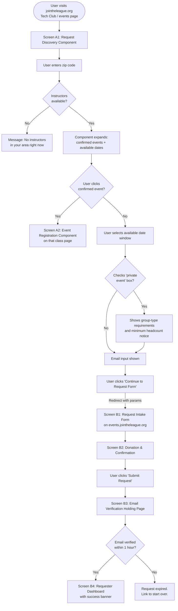
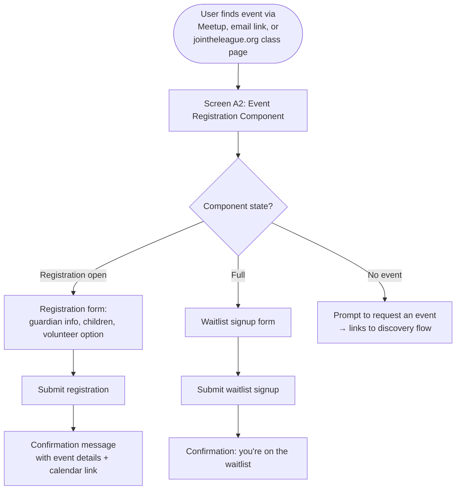
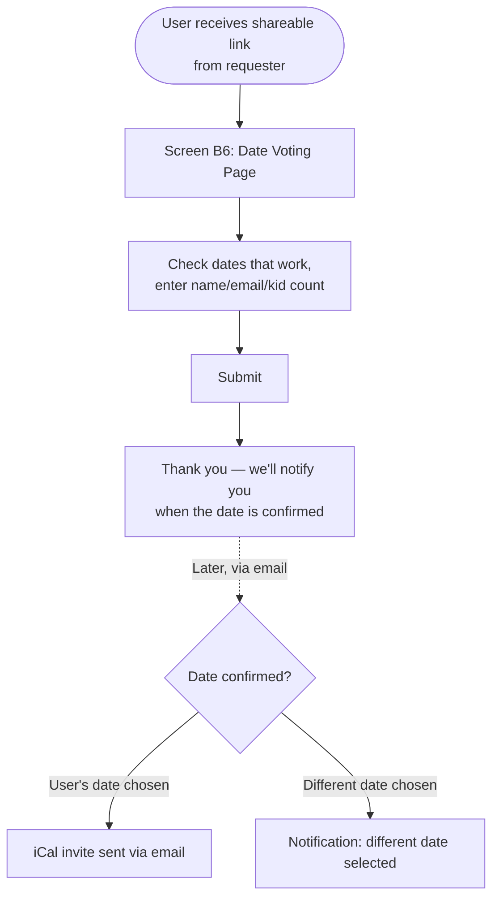
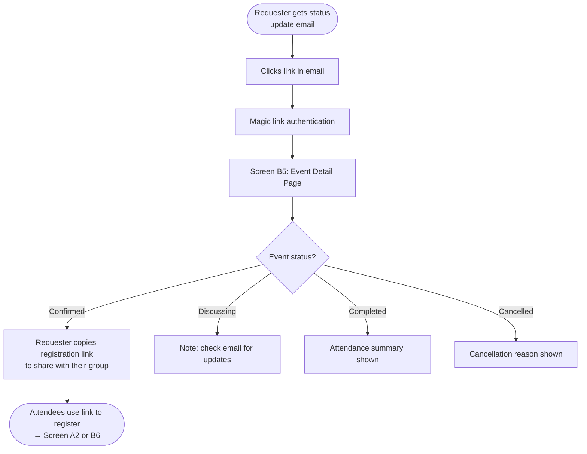

# Feature: Public-Facing UI Screens & Navigation

**Tech Club Event Request System**
Feature Document — April 2026
Base specification: Tech Club Event Request System v0.5
Related features: FEAT-1 Native Registration

---

## 1. Summary

Define the screens, navigation flows, and layout structure for the public-facing portions of the Tech Club Event Request System — the parts that requesters and attendees interact with. This document covers screens hosted on two surfaces: Astro components embedded on jointheleague.org, and pages served by the event system app itself (e.g. events.jointheleague.org). Admin and instructor screens are excluded; those will emerge from the existing admin left-nav shell during development.

This document provides a screen inventory, flow diagrams, and wireframes. It does not specify visual design (colors, typography, final layout) — those follow the League's existing brand applied through the Astro site and the event app's own stylesheet.

---

## 2. Hosting Model

The public UI spans two host surfaces with a clear handoff point between them.

### 2.1 Surface 1: jointheleague.org (Astro Components)

The League's main website is an Astro site. Two distinct Astro components serve the Tech Club system:

**Request Discovery Component** — Embedded on class/event listing pages. This is the entry point for requesters. It handles the high-bail-out portion of the flow: zip code entry, browsing available date windows, and selecting a class to request. If the user commits (enters email, clicks through), they're handed off to the event system site. This component also shows any already-confirmed upcoming events nearby as context — users can click through to register for those instead of making a new request.

**Event Registration Component** — Embedded on individual class pages (per FEAT-1 §3.5). Renders one of three states: registration form (event scheduled, spots available), waitlist form (event scheduled, full), or a request prompt (no event scheduled, linking back to the discovery component's request flow). This is attendee-facing.

Neither component carries the event app's navigation chrome. They inherit the jointheleague.org page layout and styling.

### 2.2 Surface 2: Event System App (events.jointheleague.org)

The event system is a standalone web app with its own left-side navigation menu. Public-facing pages here include:

- Request intake form (second half of the request flow, after handoff)
- Email verification holding page
- Requester dashboard (status of their requests)
- Event detail / status page
- Private event date voting page
- Donation / confirmation page

The left-nav menu is visible on all app-hosted pages. Embedded Astro components on jointheleague.org do not show it.

### 2.3 Handoff

The user transitions from Surface 1 to Surface 2 when they've selected a class and date window on jointheleague.org and are ready to fill out the full request intake form. The handoff is a link or redirect carrying the class slug, selected date(s), zip code, and event type (public/private) as URL parameters.

---

## 3. Screen Inventory

### 3.1 Astro Components (jointheleague.org)

#### Screen A1: Request Discovery Component

**Where:** Reusable Astro component embedded on any requestable class page and on dedicated "Free Events" listing pages across jointheleague.org. Appears in multiple locations — this is why it's built as a component.

**Purpose:** Let a requester find available dates to request a free Tech Club event in their area. Also surface already-confirmed events nearby for direct registration.

**Behavior (progressive disclosure, single page):**

1. **Initial state:** A zip code input field with a prompt: "Enter your zip code to see available Tech Club events near you." If the user is recognized (has a requester account via magic link session), their stored zip code is pre-populated.

2. **After zip entry:** The component expands to show two sections:
   - **Upcoming confirmed events** (if any exist near that zip): A short list of already-scheduled events with date, class name, location, and a "Register" link (goes to the Event Registration Component on the class page, or to Meetup for public events without native registration).
   - **Available dates to request:** A list of specific date/time slots within a rolling window (approximately 1 week to 6 weeks out), derived from instructor availability in Pike13. Each row shows the class name, date, time, and general area (e.g. "Python — Saturday, April 19, 3:30 PM — North County"). A "Request This" button on each row selects it. Volume is typically low — weekday afternoons and weekends only — so no pagination or additional filtering is needed.

3. **After selecting a date window:** The component expands further with:
   - A "This is a private event" checkbox. If checked, a notice appears explaining minimum headcount requirements and eligible group types (school groups, scout troops, youth organizations — not birthday parties).
   - An email input field.
   - A "Continue to Request Form →" button.

4. **On continue:** The user is redirected to the event system app (Surface 2) with the selected class, date, zip, event type, and email passed as parameters.

**Not shown here:** Class descriptions, age ranges, and topic details. Those are already on the host page provided by jointheleague.org's content. This component is a functional widget, not a content page.

#### Screen A2: Event Registration Component (FEAT-1)

**Where:** Embedded on individual class pages on jointheleague.org.

**Purpose:** Let attendees register for a confirmed event, or prompt them to request one if nothing is scheduled.

**States:**

- **Registration open:** Event details (date, time, location), remaining capacity indicator, registration form (guardian name, email, phone; one or more children with name and age; volunteer checkbox). "Register" button. Link to Meetup page if one exists.
- **Registration full:** Event details with "Event Full" badge. Waitlist signup form (name, email). Link to Meetup page.
- **No event scheduled:** Message: "No upcoming [class name] event is scheduled." Prompt to request one, with a link that scrolls to or navigates to the Request Discovery Component (A1) or directly to the request flow.

---

### 3.2 Event System App (events.jointheleague.org)

All screens below include the app's left-side navigation.

#### Screen B1: Request Intake Form

**Where:** Event system app. Linked from the Request Discovery Component (A1) after the user selects a class/date and provides their email.

**Purpose:** Collect the remaining details needed to submit an event request.

**Pre-populated from URL params:** Class name (displayed, not editable), selected date(s), zip code, event type (public/private), requester email.

**Form fields:**

- Requester name
- Group type dropdown (school, Girl Scout troop, BSA troop, library, other youth group, public — pre-selected to match event type if private)
- Expected headcount
- Site selection: searchable dropdown of registered sites near the entered zip, plus a "My location isn't listed" option that expands to a free-text address field
- Site readiness (dropdown: ready to go / needs some setup / not sure)
- Marketing capability (can you help promote this event to families?)
- Additional contacts (optional — e.g. school principal email)
- External registration URL (optional — for hosts with their own signup system)

If a registered site is selected, facility details (capacity, WiFi, projector) are shown as read-only context so the requester can confirm the space is suitable.

**Bottom of page:** "Review & Submit" button leading to Screen B2.

#### Screen B2: Donation & Confirmation

**Where:** Event system app.

**Purpose:** Encourage a donation and let the requester review and confirm their request.

**Content:**

- Summary of the request (class, date, location, group info) in a review card.
- Donation section: estimated cost to run the event, explanation of what the donation covers, prominent link to Give Lively. This is encouragement, not a gate — there's no payment form in the app.
- "Submit Request" button.
- On submit: request is saved in `unverified` status, verification email is sent, user is redirected to Screen B3.

#### Screen B3: Email Verification Holding Page

**Where:** Event system app.

**Purpose:** Tell the requester to check their email and verify.

**Content:**

- "Check your email to verify your request."
- "We sent a verification link to [email]. If you don't see it, check your spam folder."
- The verification link has a one-hour window.
- **If the user stays on this page and the hour expires:** the page updates to show "Your request has expired" with a "Start Over" link.
- **If the user clicks an expired verification link later:** same expiration message with "Start Over" link.
- **On successful verification (user clicks valid link):** redirected to Screen B4 (requester dashboard) with a success banner.

#### Screen B4: Requester Dashboard

**Where:** Event system app. Accessible after email verification creates the requester's account.

**Purpose:** Show the requester the status of their request(s).

**Authentication:** Magic link email (same pattern as site reps). The requester's account is keyed to their email. When they visit the dashboard or follow a link in a status-update email, they authenticate via magic link.

**Content:**

- List of the requester's event requests, each showing:
  - Class name
  - Status badge (new → discussing → dates proposed → confirmed → completed / cancelled)
  - Date (confirmed date, or "pending" if not yet set)
  - Location
  - Link to the event detail page (Screen B5)
- For confirmed events: a shareable registration link and current registration count.

Most requesters will have one active request. The dashboard handles multiple, but the common case is a single card.

#### Screen B5: Event Detail / Status Page

**Where:** Event system app.

**Purpose:** Show full details for a single event request. Linked from the requester dashboard and from status-update emails.

**Content varies by status:**

- **All statuses:** Class name, requested date(s), location, group info, event type, status badge, timeline of status changes.
- **Discussing / Dates Proposed:** Note that coordination is happening via email. "Check your email for updates."
- **Confirmed:** Confirmed date, instructor first name, location details. Shareable registration link (public events: also Meetup link). Registration count. If native registration is enabled (FEAT-1): breakdown of native vs. Meetup registrations.
- **Completed:** Attendance summary (if reconciliation was done per FEAT-1).
- **Cancelled:** Reason (if provided).

#### Screen B6: Private Event Date Voting Page

**Where:** Event system app. Linked from the shareable registration link for private events.

**Purpose:** Let invitees for a private event vote on which dates work and register their attendance.

**Content:**

- Class name, general location, description pulled from content.json.
- List of candidate dates with checkboxes: "Check all dates you can attend."
- Registration fields: name, email, number of kids attending.
- "Submit" button.
- After voting closes or a date is selected: this page updates to show the confirmed date and whether the voter's date was chosen. If not, a note: "The event was scheduled for [date]. We hope to see you at a future event."

---

## 4. Navigation Structure

### 4.1 Left-Side Navigation (Event System App)

The event system app has a persistent left-side nav. The menu adapts based on the user's role (determined by auth state).

**Unauthenticated / Requester:**

- My Requests (Screen B4)
- Request an Event (links back to jointheleague.org's discovery page, or directly to intake if class is known)
- Help / FAQ

**Admin (Pike13 OAuth, shown for context — not in wireframe scope):**

- Dashboard
- All Requests
- Sites
- Instructors
- Equipment
- Settings

**Instructor (Pike13 OAuth, not in wireframe scope):**

- My Events
- Profile
- Attendance (FEAT-1 reconciliation)

### 4.2 Astro Component Navigation

The Astro components have no independent navigation. They sit within jointheleague.org's existing page structure and navigation. Internal links within the components (e.g. "Register" buttons, "Request This" buttons) navigate within the component or redirect to the event system app.

---

## 5. User Flows

### 5.1 Requester Flow: Request a New Event

### 5.2 Attendee Flow: Register for a Public Event

### 5.3 Attendee Flow: Private Event Date Voting

### 5.4 Requester Flow: Post-Submission Status Tracking

---

## 6. Interaction with Existing Spec and Features

### 6.1 Spec References

- Screen A1 implements the first half of §3.1 (Requester Flow: Submit a Request), steps 1–4.
- Screen B1 implements the second half of §3.1, step 5.
- Screen B2 implements §3.1, step 6.
- Screens B3 and B4 implement §3.1, steps 7–10.
- Screen B6 implements §3.3 (Registration Flow: Private Events).
- The left-nav structure aligns with §2.2 (User Roles) role-based access.

### 6.2 FEAT-1 Interaction

- Screen A2 is the Astro component described in FEAT-1 §3.5, now with a concrete screen definition.
- The registration form fields in A2 match FEAT-1 §3.1 (guardian info, children, volunteer role).
- Screen B5 (Event Detail) incorporates FEAT-1's registration count breakdown (native vs. Meetup) when native registration is enabled.
- Attendance reconciliation (FEAT-1 §3.4) is an instructor/admin screen and is out of scope for this document.

---

## 7. Resolved Decisions

**Two Astro components, not one.** The request discovery experience (A1) and the event registration experience (A2) are separate components. A1 lives on listing pages and is about finding/requesting events. A2 lives on individual class pages and is about registering for confirmed events. They serve different users at different points in the lifecycle.

**Handoff point is after email entry, not after zip code.** The user stays on jointheleague.org through the highest-dropout portion of the flow (zip entry, browsing available dates, deciding whether to proceed). The event system app only gets users who have committed enough to provide an email and click through.

**Available dates shown as a list, not a calendar.** There aren't enough events to justify a calendar UI. A flat list grouped by class, with date and general area, is clearer.

**Private event gate is a checkbox, not a separate flow.** Public and private requests share the same discovery component. Checking "private event" shows additional requirements inline rather than branching to a different screen.

**Requester accounts are magic-link, keyed to email.** Same pattern as site representative accounts. Created automatically on email verification. No password, no forced profile setup. The account exists so the requester can access their dashboard later.

**Already-confirmed events appear in the discovery component.** When a user enters a zip and confirmed events exist nearby, those are shown alongside requestable date windows. This catches the case where a user wants to attend an existing event rather than request a new one.

**Discovery component placement — multiple pages.** The Request Discovery Component (A1) is a reusable Astro component that appears on any class page for a requestable class, as well as on dedicated "Free Events" listing pages. This is the reason it's built as a component — it needs to drop into many different page contexts across jointheleague.org. Individual class pages get the component directly; listing pages link to class pages or embed the component inline.

**Zip code persists for recognized users.** If the system recognizes the user (via their requester account / magic link session), their zip code is stored on the account and pre-populated as the default on future visits. For unrecognized users, no persistence.

**Available date windows are specific dates within a rolling window.** The system shows available instructor date/time slots from approximately 5–7 days out to 6 weeks out. These are specific dates and times (e.g. "Saturday, April 19, 3:30 PM"), not broad windows. The practical volume will be low — most availability falls on weekday afternoons and weekends, and a given class/zip combination will typically surface a handful of options, not dozens. The list doesn't need pagination or filtering beyond what the zip code already provides.

**Dashboard access is primarily via email links.** The requester dashboard (Screen B4) is accessed mainly through links in status-update emails. The jointheleague.org site has an existing "Login to your account" link; the event system dashboard is accessible from that entry point. No dedicated "Check your request status" link is added to the main site navigation.

**Multiple active requests allowed, soft cap at 10.** Requesters can have multiple concurrent active requests with no business rule limiting them. A rate limit of 10 active requests per requester email prevents spam/abuse. In practice, most requesters will have one or two.

---

## 8. Open Questions

None at this time.
